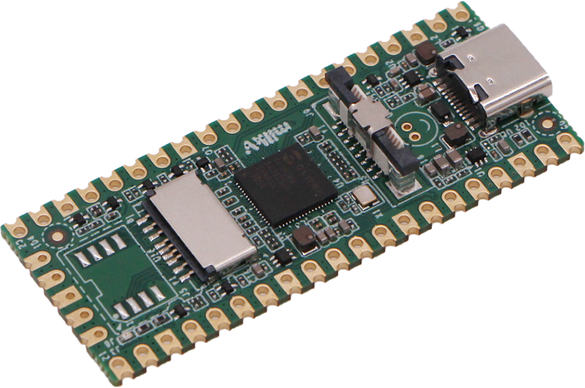
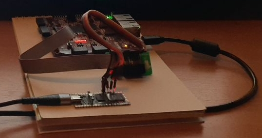

# Xilnx (X)SVF player for MilkV-Duo RISC-V system
Sources for MilkV-Duo RISC-V [board](https://milkv.io/duo) based on Clifford Wolf's <clifford@clifford.at> sources and [libxsvf repo](https://github.com/ORSoC/libxsvf)

## How to build

1. Get toolchain and examples: git clone https://github.com/milkv-duo/duo-examples.git
1. Setup: source envsetup.sh
1. Build: make
1. Copy executible file to the MilkV board by scp: make scp
1. start application and enjoy!
   
## How to build image and boot

See instruction here [https://milkv.io/docs/duo/getting-started/boot](https://milkv.io/docs/duo/getting-started/boot)

## Prototype

## Known bugs

Error executing RUNTEST ... SEC command.

Pls., comment this line in the .svf file
